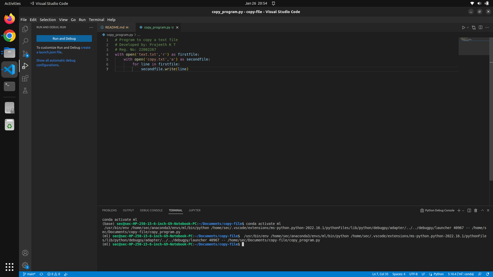
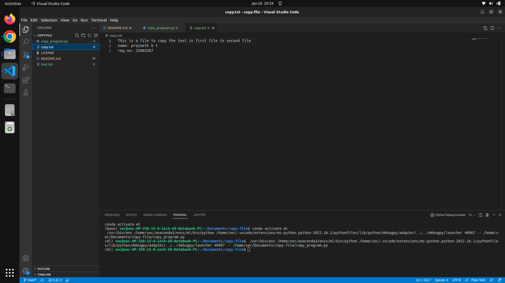

# COPY FILE

## AIM:
To write a python program for copying the contents from one file to another file.

## EQUIPEMENT'S REQUIRED: 
PC
Anaconda - Python 3.7

## ALGORITHM: 

### Step 1:
Create two text file. A file which has content [text.txt] to be copied to the empty [copy.txt] file
### Step 2: 
Using write() function copy the content from text.txt to empty file,copy.txt
### Step 3: 
Save and run the python program in terminal
### Step 4:  
The text from the text.txt file is copied to the empty file copy.txt
### Step 5: 
Then the text is shown in empty file copy.txt
### Step 6: 
The result is obtained successfully

## PROGRAM:
```python
# Program to copy a text file
# Developed by: Prajeeth K T
# Reg. No: 22002267
with open('text.txt','r') as firstfile:
    with open('copy.txt','a') as secondfile:
        for line in firstfile:
            secondfile.write(line)
```
### OUTPUT:



## RESULT:
Thus the program is written to copy the contents from one file to another file.